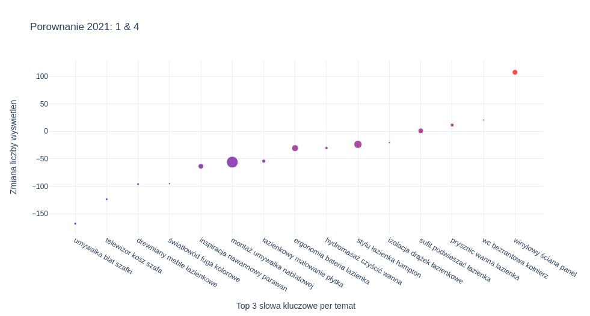

# Tutorial do obserwacji zmian wyświetleń polskich słów kluczowych z GSC, w 8 krokach.

### Inspirując się artykułem https://www.maartengrootendorst.com/blog/bertopic/ stworzyłam pipeline do analizy polskich słów kluczowych. 

W ostatnich latach naukowcy Googla stworzyli model BERT, który po dziś dzień doczekał się już wielu odmian oraz wersji językowych. Wyniki modeli BERT w dziedzinie NLP są wyjątkowe i dlatego w niniejeszym tutorialu z niego skorzystamy. Konkretniej, skorzystamy z zanurzeń (embeddings) policzonych przy pomocy frameworku SentenceTransformers i modelu BERT 'paraphrase-multilingual-MiniLM-L12-v2', który obsługuje także język polski. 

Następnie użyjemy algorytmu UMAP do redukcji liczby wymiarów oraz HDBSCAN do semantycznego pogrupowania słów kluczowych (queries) w tematy. W kolejnym kroku policzymy TF-IDF dla poszczególnych słów kluczowych w obrębie każdego tematu i wybierzemy po 3 najistotniejsze słowa. W ostatnim kroku stworzymy wykres, który pozwoli nam zobaczyć, dla których tematów widoczność w internecie zwiększyła się, a dla których zmniejszyła. Dla przykładu można użyć załączonych przeze mnie danych w formacie csv lub załadować swoje własne dane z GSC (Google Search Console). Ten tutorial zawiera kod pozwalający na pobranie własnych danych z GSC, natomiast musisz mieć tam wcześniej założone konto, śledzące ruch na Twojej witrynie. Możesz zrobić to tutaj: https://console.cloud.google.com/ oraz https://github.com/googleapis/google-api-python-client 

2021-08-20 Ilona Grabowicz

## 1. Potrzebne pakiety

Do uruchomienia tego tutorialu potrzebujesz mieć zainstalowane następujące pakiety: hunspell, pandas, sentence_transformers, umap, hdbscan, numpy, sklearn, plotly, oauth2client, googleapiclient, requests, json, datetime, time. 

Najlepiej je zainstalować przy pomocy komendy pip:

```pip install hunspell
pip install pandas
pip install sentence-transformers
pip install umap
pip install hdbscan
pip install numpy
pip install sklearn
pip install plotly
pip install oauth2client
pip install google-api-python-client
pip install requests
```

Ponadto potrzebujesz także słownika hunspell dla języka polskiego. Jeśli nie masz go zainstalowanego możesz go pobrać przy pomocy komend: 

`wget -O pl_PL.aff  https://cgit.freedesktop.org/libreoffice/dictionaries/plain/pl_PL/pl_PL.aff`

`wget -O pl_PL.dic https://cgit.freedesktop.org/libreoffice/dictionaries/plain/pl_PL/pl_PL.dic`


```python
# Na poczatek ladujemy potrzebne slowniki i pakiety do analizy danych
import hunspell
hobj_pl = hunspell.HunSpell('/usr/share/hunspell/pl_PL.dic', '/usr/share/hunspell/pl_PL.aff')
import pandas as pd
from sentence_transformers import SentenceTransformer
import umap
import hdbscan
import numpy as np
from sklearn.feature_extraction.text import CountVectorizer
import plotly.graph_objects as go
```


```python
# Oraz pakiety do pobierania danych z GSC
from oauth2client.service_account import ServiceAccountCredentials
from googleapiclient.discovery import build
import requests
import json
import pandas as pd
```


```python
# Wybierz rok oraz miesiące, dla których chcesz przeanalizować zmiany wyświetleń. 
# To jest potrzebne do zrobienia wykresu oraz do pobrania danych z GSC.
rok = '2021'
miesiac = '1'
rok_2 = '2021'
miesiac_2 = '4'
```

## 2. Wczytanie swoich danych. 

### Opcja 1 - Pobranie danych z GSC

Potrzebujesz mieć założone konto w GSC dla Twojej domeny oraz wygenerowany plik credentials_gsc.json z kluczem. Więcej info tutaj https://console.cloud.google.com/ oraz https://github.com/googleapis/google-api-python-client


```python
gscKey = 'credentials/credentials_gsc.json'

# Funkcja do laczenia z API GSC i autoryzacja

def gscConnect(gscKey):
    gscScope = 'https://www.googleapis.com/auth/webmasters'
    gscCredentials = ServiceAccountCredentials.from_json_keyfile_name(gscKey, scopes=gscScope)
    gscService = build('webmasters', 'v3', credentials=gscCredentials)
    return gscService
```


```python
# Wyslanie zapytania do API GSC o liczby wyswietlen (mozemy to zamienic rowniez na kliki)

# Musimy podac nasza konretna domene, dla ktorej mamy konto, np.:

siteUrl = 'sc-domain:mojastrona.pl'

if len(miesiac)==1:
    my_startDate = rok+'-0'+miesiac+'-'+'01'
    my_endDate = rok+'-0'+miesiac+'-'+'31' 
    my_startDate2 = rok_2+'-0'+miesiac_2+'-'+'01'
    my_endDate2 = rok_2+'-0'+miesiac_2+'-'+'31' 
else:
    my_startDate = rok+'-'+miesiac+'-'+'01'
    my_endDate = rok+'-'+miesiac+'-'+'31' 
    my_startDate2 = rok_2+'-'+miesiac_2+'-'+'01'
    my_endDate2 = rok_2+'-'+miesiac_2+'-'+'31' 

def gscQuery(gscService, siteUrl, payload):
    response = gscService.searchanalytics().query(siteUrl=siteUrl, body=payload).execute()
    results = []
    
    for row in response['rows']:    
        data = {}
        for i in range(len(payload['dimensions'])):
            data[payload['dimensions'][i]] = row['keys'][i]
        #data['clicks'] = row['clicks']
        data['impressions'] = row['impressions']
        #data['ctr'] = round(row['ctr'] * 100, 2)
        #data['position'] = round(row['position'], 2)        
        results.append(data)
    return pd.DataFrame.from_dict(results)

gscService = gscConnect(gscKey)

# Dane za pierwszy miesiac:

payload = {
    'startDate': my_startDate,
    'endDate': my_endDate,
    #'dimensions': ['page','device','query'],
    'dimensions': ['query'],
    'rowLimit': 5000,
    'startRow': 0,
    'dimensionFilterGroups': [
    {
      'filters': [
        {
          'dimension': 'page',
          'operator': 'notContains',
          'expression': 'en_GB'
        },
        {
          'dimension': 'country',
          'operator': 'equals',
          'expression': 'POL'
        }
      ]
    }
  ]
}

# Dane za drugi miesiac:

payload2 = {
    'startDate': my_startDate2,
    'endDate': my_endDate2,
    #'dimensions': ['page','device','query'],
    'dimensions': ['query'],
    'rowLimit': 5000,
    'startRow': 0,
    'dimensionFilterGroups': [
    {
      'filters': [
        {
          'dimension': 'page',
          'operator': 'notContains',
          'expression': 'en_GB'
        },
        {
          'dimension': 'country',
          'operator': 'equals',
          'expression': 'POL'
        }
      ]
    }
  ]
}

DT = gscQuery(gscService, siteUrl, payload)
print(DT.head())
DT_2 = gscQuery(gscService, siteUrl, payload2)
print(DT_2.head())
```

                                      query  impressions
    0                             próchnica         9237
    1  szczoteczka elektryczna czy soniczna         1619
    2  szczoteczka soniczna czy elektryczna         1720
    3               końcówki do szczoteczki         40046
                                      query  impressions
    0  szczoteczka soniczna czy elektryczna         1217
    1               kiedy wypadają mleczaki         2048
    2  szczoteczka elektryczna czy soniczna         1237
    3                          czarny język          841


### Opcja 2 - Dane w formacie csv

Jeśli pobierasz dane w inny sposób, to do tego tutorialu potrzebujesz przygotować 2 pliki o nazwach 'DT.csv' i 'DT_2.csv'. 

Oba pliki muszą zawierać kolumny 'query' i 'impressions'.

Przykładowe pliki, które możesz pobrać są dostępne w tym repozytorium:

https://github.com/ilona-grabowicz/queries_clustering_and_visualisation


```python
# Wczytanie pliku z danymi za wcześniejszy miesiąc: 
DT = pd.read_csv('DT.csv')  
DT = DT[['query', 'impressions']]

# Wczytanie pliku z danymi za drugi miesiąc: 
DT_2 = pd.read_csv('DT_2.csv')  
DT_2 = DT_2[['query', 'impressions']]

print(DT.head())
print(DT_2.head())
```

                                 query  impressions
    0            akcesoria do łazienki            1
    1  akcesoria do łazienki drewniane            1
    2  akcesoria do łazienki drewniane            1
    3  akcesoria do łazienki drewniane            1
    4     akcesoria do łazienki drewno            1
                                     query  impressions
    0                akcesoria do łazienki            1
    1  akcesoria do łazienki bez wiercenia            2
    2          akcesoria do łazienki retro            1
    3          akcesoria do łazienki retro            1
    4          akcesoria do łazienki retro            1


W obu plikach sumujemy wyswietlenia (impressions) z roznych dni dla kazdego query.  


```python
# Sumowanie wyświetleń dla obu miesięcy
DT = DT.groupby('query')['impressions'].sum() # to jest w utf-8 
DT = DT.to_frame()
DT = DT.reset_index()

DT_2 = DT_2.groupby('query')['impressions'].sum() # to jest w utf-8 
DT_2 = DT_2.to_frame()
DT_2 = DT_2.reset_index()
```

Następnie, niezależnie od wybranej przed chwilą opcji, laczymy oba pliki i tworzymy nowa kolumne zawierajaca zmiany liczb wyswietlen.

## 3. Pre-processing danych


```python
# Laczenie plikow
data = pd.merge(DT, DT_2, on='query', how = 'outer', suffixes=('_1', '_2'))
# Odsianie queries ktore mialy malo wyswietlen
data = data[(data['impressions_1'] > 50) | (data['impressions_2'] > 50)]
# Uzupelnienie NA zerami
data['impressions_1'] = data['impressions_1'].fillna(0)
data['impressions_2'] = data['impressions_2'].fillna(0)
data = data.reset_index(drop=True)
data['Difference'] = data['impressions_2'] - data['impressions_1']
data = data.rename(columns={"query": "Doc"})
data.head()
```


```python
# Zapisujemy plik z datami - to będzie nam potrzebne na koniec do zrobienia wykresu.
metadane = {'year_1': [rok], 'month_1': [miesiac], 'year_2': [rok_2], 'month_2': [miesiac_2]}
metadane = pd.DataFrame(data=metadane)
metadane.to_csv(path_or_buf = 'metadane.csv', index=False)
```

## 4. Tworzenie zanurzeń z BERTem (embeddings)

Gdy nasze dane zostały już oczyszczone i odpowiednio sformatowane, możemy przystąpić do stworzenia zanurzeń (embeddings), czyli numerycznego przedstawienia danych tekstowych. Do tego celu użyjemy frameworku SentenceTransformers oraz modelu BERT 'paraphrase-multilingual-MiniLM-L12-v2', który dobrze radzi sobie także z tekstami w języku polskim. 


```python
model = SentenceTransformer('paraphrase-multilingual-MiniLM-L12-v2') 
embeddings = model.encode(data['Doc'], show_progress_bar=True)
```


    HBox(children=(FloatProgress(value=0.0, description='Batches', max=4.0, style=ProgressStyle(description_width=…


    


## 5. Grupowanie

Stworzony w poprzednim kroku obiekt embeddings ma wymiary 2825 x 384, z których pierwszy odpowiada liczbie słów kluczowych. W następnym kroku dokonamy redukcji drugiego wymiaru z 384 do 5, żeby ułatwić grupowanie słów. Wykorzystamy do tego algorytm [UMAP](https://github.com/lmcinnes/umap). Przy pomocy parametru n_components możemy zdecydować jak bardzo chcemy zredukować liczbę wymiarów. Trzeba pamiętać, że zbyt duża redukcja prowadzi do utraty informacji, natomiast pozostawienie zbyt wielu wymiarów utrudnia grupowanie.

Samo grupowanie zrobimy używając [HDBSCAN](https://hdbscan.readthedocs.io/en/latest/how_hdbscan_works.html). Tutaj także możemy zmieniać wartości paramterów, np. zwiększając min_cluster_size, sprawimy, że najmniejsze grupy będą miały większą liczbę słów kluczowych. Jednocześnie trzeba pamiętać, że część słów może wtedy nie zostać przypisana do żadnej grupy i wpadnie do grupy nieokreślonej, czyli '-1' (kolumna 'Topic' w zmiennej docs_df - poniżej). Jeśli mamy większy zbiór danych to lepiej zwiększyć ten parametr do np. 10. 


```python
umap_embeddings = umap.UMAP(n_neighbors=5, 
                            n_components=5, 
                            metric='cosine').fit_transform(embeddings)
```


```python
cluster = hdbscan.HDBSCAN(min_cluster_size=2,
                          metric='euclidean', 
                          #cluster_selection_epsilon = 0.4,                     
                          cluster_selection_method='eom').fit(umap_embeddings)

```


```python
# Tworzymy zmienna dosc_df, z przypisanymi do poszczegolnych slow numerami tematow.

docs_df = pd.DataFrame(data, columns=["Doc"])
docs_df['Topic'] = cluster.labels_
docs_df['Doc_ID'] = range(len(docs_df))
docs_df
```


## 6. Lematyzacja

Polskie słowa najczęściej wystepują odmienione w jakimś przypadku. Do analizy najczęściej wystepujących słów w danym temacie najpierw potrzebujemy je zlematyzować, czyli sprowadzić do ich podstawowej formy. Do tego celu skorzystamy z pakietu hunspell. Jeśli masz jakieś konkretne słowa, których nie chcesz zmieniać, np. słowa brandowe, to wpisz je do listy 'words_not_to_change', w kodzie poniżej.


```python
# Lematyzacja. Plik z polskimi stopwordami możesz pobrać 
# z mojego repozytorium 
# https://github.com/ilona-grabowicz/queries_clustering_and_visualisation
my_encoding = hobj_pl.get_dic_encoding()
query_lemmas = []
words_not_to_change = ["superpharm, agata"]

pl_stopwords_file = open('./polish_stopwords.txt', 'r').readlines()
pl_stopwords = [polish_stopword.strip() for polish_stopword in pl_stopwords_file]
i=0
for word in docs_df["Doc"]:  
    split_words = word.split()
    query_replacement = []
    for split in split_words:
        print(split)
        if split in pl_stopwords or split in words_not_to_change:
            continue
        stems = hobj_pl.stem(split)
        if len(stems)>0:
            split = stems[0].decode(my_encoding)
            print(split)
            query_replacement.append(split)
        else:
            query_replacement.append(split) # niezmienione slowo
    query_replacement = " ".join(query_replacement)
    query_lemmas.append(query_replacement)
    i=i+1
print('Lemmatization finished.')

docs_df["Doc"] = query_lemmas
```

    ażurowa
    ażurowy
    zabudowa
    zabudowa
    pieca
    piec
    gazowego
    gazowy
    bateria
    ...
    Lemmatization finished.


## 7. Wyciągnięcie tematów

Gdy mamy już nasze słowa kluczowe pogrupowane, tzn. przypisane do poszczególnych tematów, to chcielibyśmy się dowiedzieć, czym te grupy się charakteryzują, tzn na jaki temat są dane słowa kluczowe. Do tego celu wykorzystamy wariant TF-IDF dla klas [c-TF-IDF opisany tutaj](https://www.maartengrootendorst.com/blog/bertopic/). Dla każdej grupy wybierzemy 3 słowa o najwyższym c-TF-IDF, jako najbardziej charakterystyczne dla danej grupy. 


```python
docs_df['Difference'] = data['Difference']
docs_per_topic = docs_df.groupby(['Topic'], as_index = False).agg({'Doc': ' '.join, 'Difference': 'sum'})

def c_tf_idf(documents, m, ngram_range=(1, 1)):
    count = CountVectorizer(ngram_range=ngram_range, stop_words=pl_stopwords_file).fit(documents)
    t = count.transform(documents).toarray()
    w = t.sum(axis=1)
    tf = np.divide(t.T, w)
    sum_t = t.sum(axis=0)
    idf = np.log(np.divide(m, sum_t)).reshape(-1, 1)
    tf_idf = np.multiply(tf, idf)

    return tf_idf, count
  
tf_idf, count = c_tf_idf(docs_per_topic.Doc.values, m=len(data))

```


```python
def extract_top_n_words_per_topic(tf_idf, count, docs_per_topic, n=20):
    words = count.get_feature_names()
    labels = list(docs_per_topic.Topic)
    tf_idf_transposed = tf_idf.T
    indices = tf_idf_transposed.argsort()[:, -n:]
    top_n_words = {label: [(words[j], tf_idf_transposed[i][j]) for j in indices[i]][::-1] for i, label in enumerate(labels)}
    return top_n_words

def extract_topic_sizes(df):
    topic_sizes = (df.groupby(['Topic'])
                     .Doc
                     .count()
                     .reset_index()
                     .rename({"Topic": "Topic", "Doc": "Size"}, axis='columns')
                     .sort_values("Size", ascending=False))
    return topic_sizes

top_n_words = extract_top_n_words_per_topic(tf_idf, count, docs_per_topic, n=3)
topic_sizes = extract_topic_sizes(docs_df); topic_sizes.head(10)

```

```python
def extract_first_el(lista):
    new_list = [ seq[0] for seq in lista ]
    return new_list

docs_per_topic['Top_n_words'] = docs_per_topic['Topic'].map(top_n_words) # Robie nowa kolumne z danymi ze slownika top_n_words
docs_per_topic['Top_n_words'] = docs_per_topic['Top_n_words'].apply(extract_first_el) # Wyciagam tylko slowa z listy tupli: (slowo, tfidf)
docs_per_topic = docs_per_topic.merge(topic_sizes, on='Topic', how='left') # Dodaje kolumne z Topic_sizes
docs_per_topic.columns = ['Topic_sizes' if x=='Size' else x for x in docs_per_topic.columns] # Renaming a column 'Size'
docs_per_topic
```


W powyższy sposób otrzymaliśmy data frame o liczbie wierszy równej liczbie tematów - w przypadku użycia danych z plików csv, mamy 15 tematów. Temat '-1' to jest grupa zawierają słowa kluczowe, które nie zostały przypisane do żadnej innej grupy. Kolumna Doc, zawiera nasze slowa kluczowe po oczyszczeniu ze stopwordów i lematyzacji. Kolumna Difference zawiera sumę zmian liczb wyświetleń dla wszystkich słów kluczowych znajdujących się w danej grupie. Kolumna Top_n_words zawiera 3 słowa o najwyższych TF-IDF, czyli najważniejsze słowa, po lematyzacji. Kolumna Topic_sizes, zawiera informacje o tym ile słów kluczowych zostało przypisanych do grup. Stworzymy jeszcze jedną kolumnę Difference_per_topic_size, gdzie sumy zmian liczb wyświetleń znormalizujemy poprzez podzielenie przez rozmiary danych grup, aby móc porównać je między sobą. Data frame możemy pobrać w formie pliku csv 'docs_per_topic.csv'. 


```python
docs_per_topic['Difference_per_topic_size'] = docs_per_topic['Difference'] / docs_per_topic['Topic_sizes']
docs_per_topic.to_csv(path_or_buf = 'docs_per_topic.csv', index=False)
docs_per_topic
```

## 8. Wizualizacja

Ostatnim krokiem naszej analizy jest stworzenie wykresu, na którym będziemy mogli zobaczyć, które grupy słów kluczowych zanotowały spadki, a które wzrosty wyświetleń. Wykorzystamy do tego pakiet plotly, który pozwala na wizualizację interaktywną. 


```python
docs_per_topic['Top_n_words'] = docs_per_topic['Top_n_words'].str.join(' ')
docs_per_topic = docs_per_topic.sort_values(by=['Difference_per_topic_size'])
docs_per_topic.head()
```


```python
if rok ==rok_2:
  my_title = 'Porownanie '+rok+": "+miesiac+' & '+miesiac_2
else:
  my_title = 'Porownanie  '+rok+": "+miesiac+' & '+rok+': '+miesiac_2

fig = go.Figure()

fig.add_trace(go.Scatter(
    x=docs_per_topic['Top_n_words'], 
    y=docs_per_topic['Difference_per_topic_size'],
    name='Topics',
    mode='markers',
    marker = dict(color=docs_per_topic['Difference_per_topic_size'],
                  colorscale='Bluered',
                  #showscale=True,
                  size = docs_per_topic['Topic_sizes']),
    hovertemplate = 'Zmiana wyswietlen: %{y:.1f}<br>Liczba słów: %{text}',
    text = docs_per_topic['Topic_sizes'],
    showlegend = False))

fig.update_layout(title=my_title,
yaxis_zeroline=False, xaxis_zeroline=False,
xaxis_title="Top 3 slowa kluczowe per temat",
yaxis_title="Zmiana liczby wyswietlen",
template='plotly_white')

fig.show()
```

## Dziękuję za doczytanie do końca tutorialu! 

Pełen kod oraz potrzebne pliki znajdują się w repozytorium. 

https://github.com/ilona-grabowicz/queries_clustering_and_visualisation 
